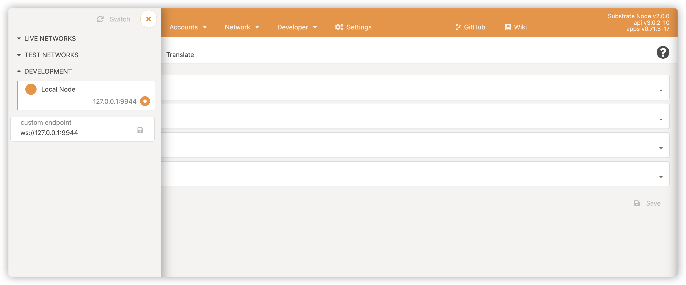
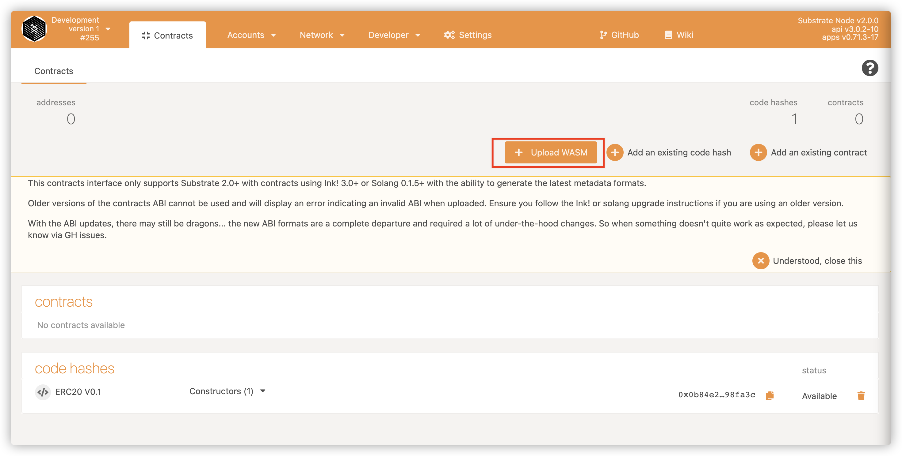
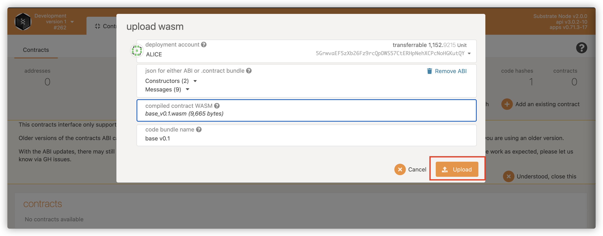
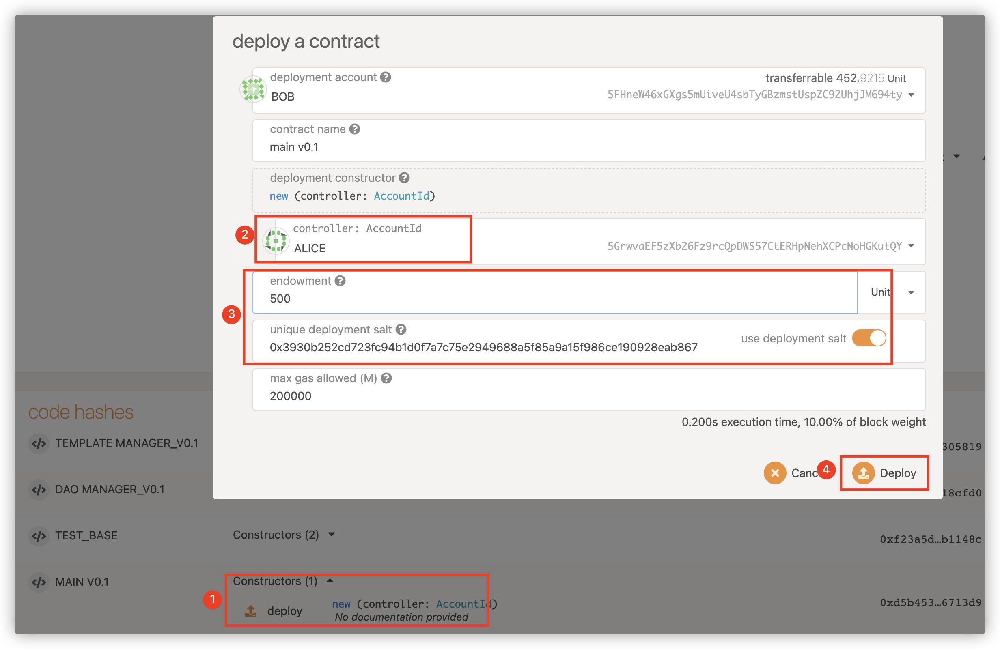
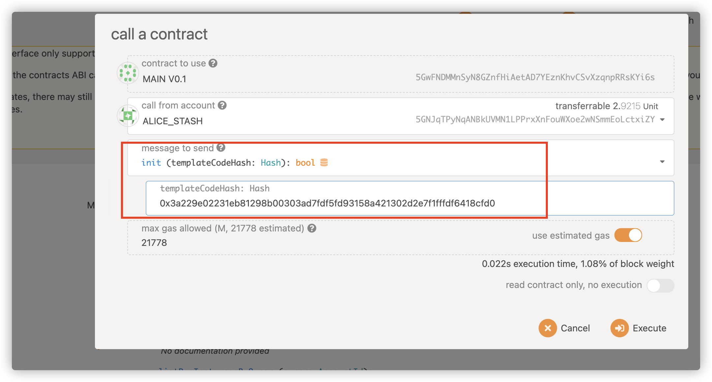
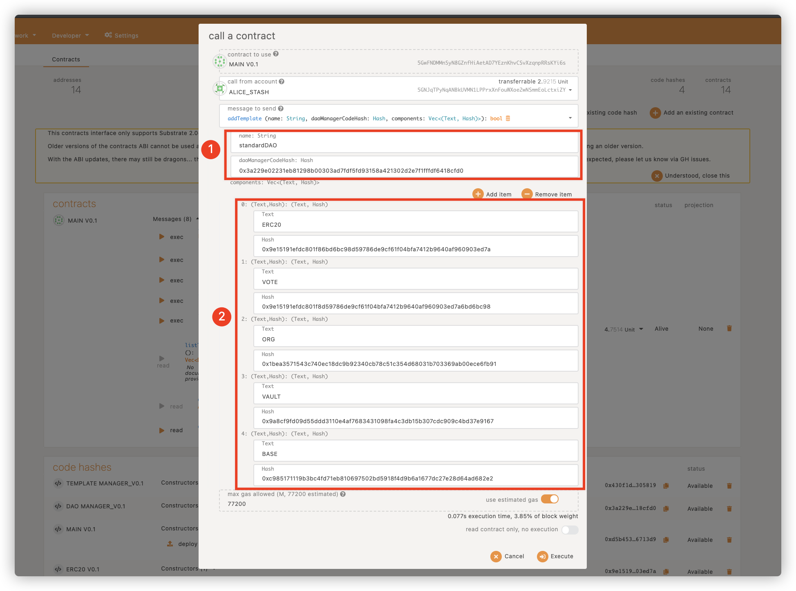

## Setup with Docker
Docker Image: [https://drive.google.com/drive/folders/1VRm0puMeYOj6c8hHGNlKmZZyN9D8mo-v?usp=sharing](https://drive.google.com/drive/folders/1VRm0puMeYOj6c8hHGNlKmZZyN9D8mo-v?usp=sharing)

Get docker image and load with `docker load < <tarball>`

## Over view of Ink! contracts
### SubDAO Main Module

TheSubDAOMain is the base contract for SubDAO, developed by SubDAO Labs to manage the Template and Module that SubDAO supports.TheSubDAOMain needs to provide Template Library management, Module Library management, and Dao creation.

### SubDAO Template Module

AllDAOsare created from Template, and all supported modules are recorded in Template. The Template functionality includes the creation of the Dao, the creation process for defining the DAO, and the supported Module functionality. The required interfaces are as follows:

### **SubDAO Base Module**

The basic information of the DAO is managed throughtheBase Module, which contains the name, Logo, organization description, and creator of the DAO organization.

### **SubDAO Org Module**

There are different forms of organization for any organization, but there must be its founders, its moderators, and its participants. The SubDAOOrg Module provides a flexible way to distinguish between membership and the responsibilities of Dao community governance. The current version realizes the identity division and responsibility setting of different members in a minimal way, and the membership is divided into three identities: creator, moderator,and participants.

### **SubDAO Vault Module**

The operation of the DAO organization is in need of financial support, mainly for the DAO members to contribute to reward. The management of money needs to be done in a democratic way. Not everyone can manage money, only the founders and moderators, or by voting. The money in the Vault comes from outside donations, and Native tokens and ERC20 tokens can be supported depending on the settings.

### **SubDAO Voting Module**

Voting with any organization is the basis for the implementation of democracy, only with the Voting capacity and mechanisms to constitute a DAO. In SubDAO Voting Module provides Voting-related functions, allowing any member that can initiate Voting to initiate Voting and set Voting rules. All members can vote using Token.

### **SubDAO Token Module**

In Dao organization, Token is the symbol of rights and power, through Token can exercise the power of community governance, through Token can get the reward after contribution. In SubDAO, the SubDAO Token Module provides functions related to Token management, such as Token issuance, Token issuance, Token destruction, Token transfer, and so on. In the SubDAO Token Module, Token currently follows the ERC20 standard.


## Compile Contracts

SubDAO provides scripts to simplify the contract compilation process while collecting the editing results into a unified directory to facilitate contract deployment and usage. Execute in the project root directory

```bash

bash ./build.sh

```

All contract compilation results are saved in the release directory.

## Deploy

TheSubDAO creates the substrate chain to connect the POLKADOT Ecology, and all contracts are deployed on the SubDAO chain. This section explains how to make use of PolkadotJSAppto deploycontracts.


Download and compile Polkadot JS Apps code, followed by yarn start startup. Access the front page http://localhost:3000/ and set the node IP and port.




### Deploy Contracts

Enter developer-> Contracts and click Upload WASM.



Select the ABI and WASM files that require the deployment contract, click Upload, and Submit and Sign.



Wait a moment and the contract code will be uploaded.

### Deployment contract

After you upload the contract, you can instantiate the contract on the chain. In substrate, you need to perform the contract’s initialization function, usually new or the default function.

ForSubDAO contracts, all contracts are instantiated by the main contract. So the only contractSubDAO really needs to be deployed is the main contract. The main contract is responsible for managing contract templates and Dao instantiations.




Select the initialization function call, fill in the initialization parameters, set the main contract administrator, and set the contract initial balance, click Deploy. Note that the deployment salt is used.


## Initialization

### Initialize the Main contract

The main contract manages the DAO templates and Dao instantiations. After the main contract is deployed, you need to initialize the template management function of Main, call the init function and set the code of the contract template.




### Add DAOtemplates

For now, Dao templates can only be configured in the tool by calling the addTemplate function in the main contract, setting the code for the DAO-moderator contract, and the code for the components in the template.

For example, we create a DAO template with money management, platform tokens, organizational management, voting, and can set the name for the template.

After adding the Dao template, you can happily create the DAO organization through theSubDAO front end.




### Creating DAO

After you create a template, you can create your own DAO from the template that you have set up.

Jump to the frontend.


