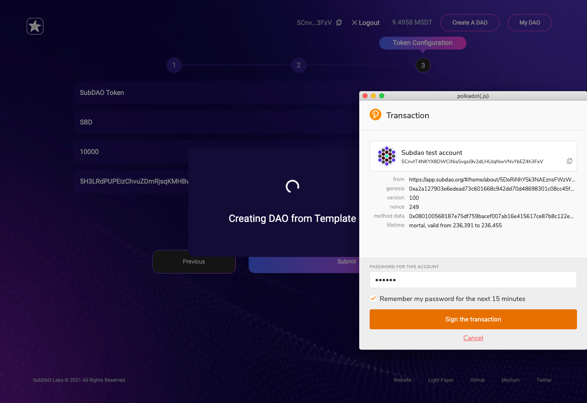
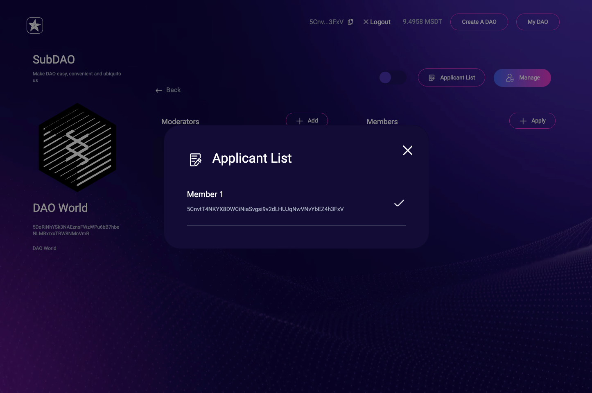
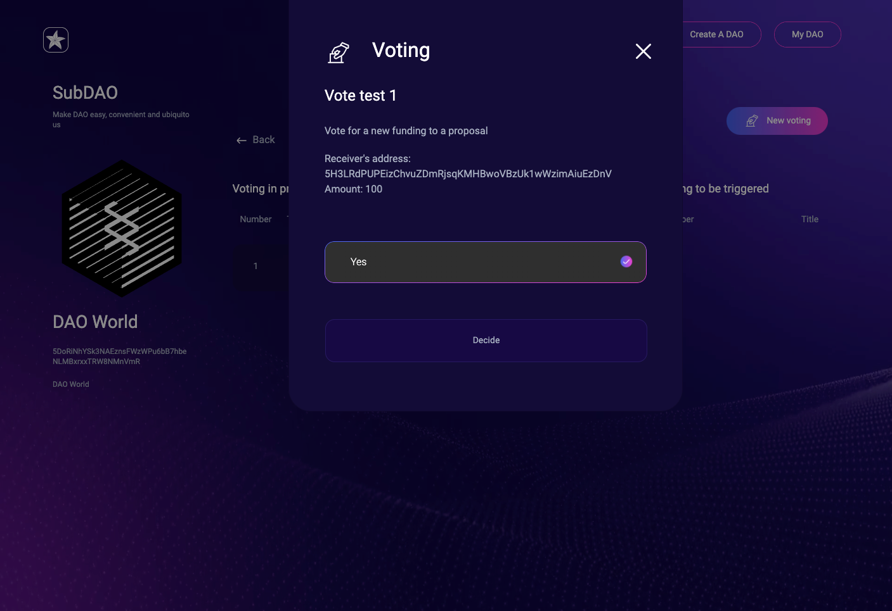

Please make sure you already have installed the wallet[https://polkadot.js.org/extension/](https://polkadot.js.org/extension/?fileGuid=6prdjVCwTYv6cpRX) and created your account.

**Please make sure you have enough unit in your account before you start!**

## Home page

The SubDAO home page is [https://app.subdao.org/](https://app.subdao.org/), or the url where you deploy it.

## Connect wallet
First Click the `Connect Wallet` button to Connect to your Wallet and select your account.

## Show the DAO list

You can seeall your created DAOs at the bottom of the page, your account information is at the top right corner, you can see DAO details by clicking the logo of a DAO.

There are multiple parts in a DAO page, such as Balance, Moderators, Contracts and so on.

## Create Your Own DAO

Click the `Create A DAO` button at top nav bar to start creating your first DAO.

The first step is to set up basic information, fill in your DAO Logo URL on the left and name and description on the right. See the image below.

The second step is to select The DAO template, the first one is chosen by default.

The third step is to setup token.

Click `Submit` button then signing to create DAO, sign confirm box will be pop up many times in this step.  Please wait for the transaction finalized on the chain, and it will be fine. If you want to avoid repeatedly entering the password, please just check `Remember my password for the next 15 minutes` in sign confirm box.

Finally your DAO will be created, the following figure shows the result of creation. This DAO can be seen on the home page. You can also click `Manage` directly jump to  the management page.

## View Your DAO

You can see the current DAO information, Balance, Moderators, Contracts, and so on.

## Manag DAO members

In the DAO Page, click the `ORG` button to access organization management.

You can see all the current members.

Click the `Manage` button to enter the management page, you can see the moderators and members of the DAO can be added and deleted information.

Adding an moderator and a member initiates a transaction, after which of course the DAO’s moderator can have permission to operate.

As a owner, you can set whether to allow outside people to join the DAO as a member publicly, it's now allowed by default.

If it's now allowed to join publicly, user needs to apply for the joining.

Owner can check the `Applicant List` and make the approvement.

Owner can transfer ownership to a new owner. Member can exit a DAO.

## Manage Vault assets

On the DAO page, click `Vault` to access the assets management page.

Vault allows members to deposit directly, and withdraw funds by voting. Vault’s balance and transaction history are open to all.

On the deposits page, you can choose your own account to deposit a certain amount of token, and click `Request` to deposit assets.

Then you can see the Vault’s financial history in the Vault.

## Manage the vote

Click the `Voting` button in the DAO page to go to the Voting page.

You can create a New vote by clicking the `New Voting` button.

Enter `End Time` and `Title`.

Enter `Minimum support require numbers` and `Minimum voter require numbers`.

Enter `Description`.

Enter `Options` you want users to choose later.

If need to transfer token after the voting pass, fill this form.

Click `Create` button, then sign, the voting will be created and showed on the `Voting` page.

Now You can vote.

If the voting gets passed and reaches the end time, the voting can be trigger to do the transferring.

Transferring is successfully.

The voting is finished.

