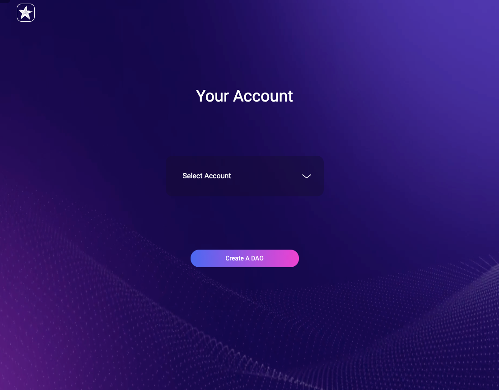

Please make sure you already have installed the wallet[https://polkadot.js.org/extension/](https://polkadot.js.org/extension/?fileGuid=6prdjVCwTYv6cpRX) and created your account.

## Home page

The SubDAO home page is [http://localhost:3000/](http://localhost:3000/), or the url where you deploy it.

## Connect wallet
First Click the `Connect Wallet` button to Connect to your Wallet and select your account.

## Show the DAO list

You can see the home page with all DAOs listed, the top right corner is your account information, the middle is all the created DAOs, you can switch through the arrows on both sides, you can also click on the middle of the DAO Access View.

On the left is the DAO profile, and on the right is the DAO module information, such as balance, administrator, module contract address, module entry, and so on.

## Create Your Own DAO

Click the `Create My DAO` button on the home page to start creating your First DAO.

The first step is to set up the DAO basic information, fill in your DAO thumbnail URL on the left and Dao name and description on the right. Take the image below.

The second step is to select The DAO template, where you can select `The Last ONE` and display what DAO modules The template has.

The first box sets the administrator of the DAO, the second box sets the native Token information of the Dao and the initial total, and the third box sets the amount of money to be pre-transferred to each account when the Dao is created.

The fourth step is mainly signing to create DAO, sign confirm box will be pop up many times in this step.  Please wait for the signature on the chain, and it will be fine. If you want to avoid repeatedly entering the password, please just check `Remember my password for the next 15 minutes` in sign confirm box.

Finally your DAO will be created, the following figure shows the result of creation. This DAO can be seen on the home page. You can also click `Manage` directly jump to  the management page.

## View Your DAO

Go directly to the Admin DAO page by clicking `Manage` on the home page or once you’ve created it. You can see the current DAO information, balance, administrator, contract address, and module entry.

